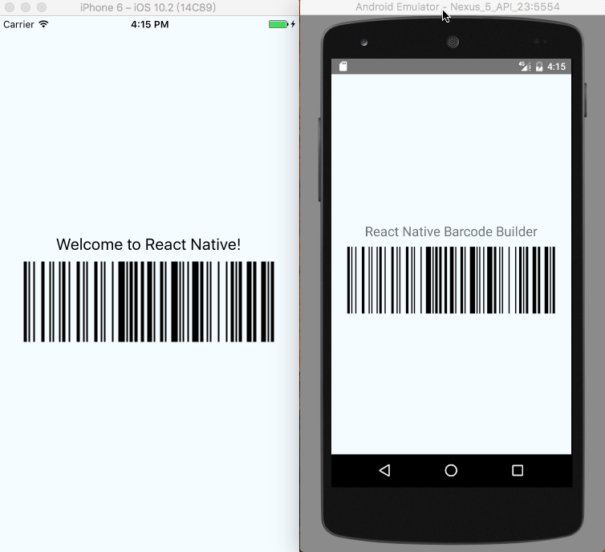

# react-native-barcode-builder

A component for react native to generate barcode. Inspired by [JsBarcode](https://github.com/lindell/JsBarcode).

## Getting started

#### Step 1

Link React ART; open the Xcode project, and drag `ART.xcodeproj` from `node_modules/react-native/Libraries/ART/` into the `Libraries` group in Xcode.
Then select the root project and select "Build Phases" from the center view. There will be a section called "Link Binary With Libraries", expand it, press the + and select `libART.a`.

#### Step 2

Install react-native-barcode-builder

`npm install react-native-barcode-builder --save`


#### Step 3

Start using the component

```javascript
import Barcode from 'react-native-barcode-builder';

<Barcode value="Hello World" format="CODE128" />
```

Available formats are shown in the following:

```
/* Select which barcode type to use */
format: PropTypes.oneOf([
  'codabar',
  'CODE39',
  'CODE128', 'CODE128A', 'CODE128B', 'CODE128C', // Note: Using 'CODE128' will automatically detect which subtype you need and use it.
  'EAN2', 'EAN5', 'EAN8', 'EAN13',
  'UPC',
  'GenericBarcode',
  'ITF', 'ITF14',
  'MSI', 'MSI10', 'MSI11', 'MSI1010', 'MSI1110', // Note: Using 'MSI' will automatically detect which subtype you need and use it.
  'pharmacode'
])
```



## Properties

<table style="width:80%">
  <tr>
    <th>Property</th>
    <th>Description</th>
  </tr>
  <tr>
    <td><code>value</code></td>
    <td>What the barcode stands for (required).</td>
  </tr>
  <tr>
    <td><code>format</code></td>
    <td>Which barcode type to use (default: CODE128).</td>
  </tr>
  <tr>
    <td><code>width</code></td>
    <td>Width of a single bar (default: 2)</td>
  </tr>
  <tr>
    <td><code>height</code></td>
    <td>Height of the barcode (default: 100)</td>
  </tr>
  <tr>
    <td><code>text</code></td>
    <td>Override text that is displayed.</td>
  </tr>
  <tr>
    <td><code>lineColor</code></td>
    <td>Color of the bars and text (default: #000000)</td>
  </tr>
  <tr>
    <td><code>background</code></td>
    <td>Background color of the barcode (default: #ffffff)</td>
  </tr>
  <tr>
    <td><code>onError</code></td>
    <td>Handler for invalid barcode of selected format</td>
  </tr>
</table>
